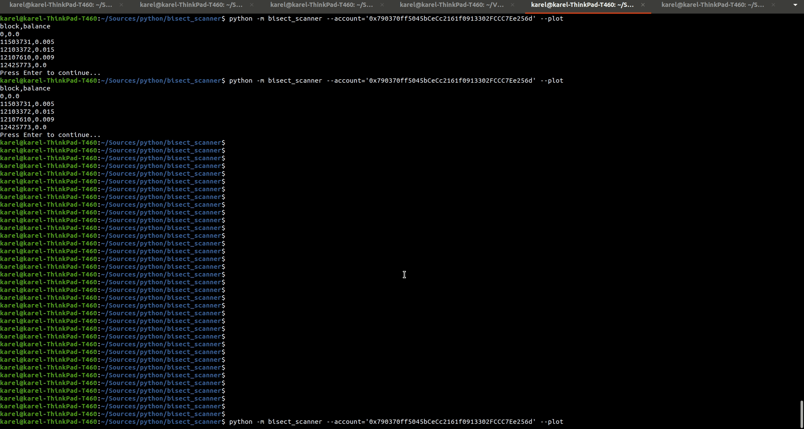

# bisect_scanner

Determine crypro accounts balance history using bisection algorithm

## Usage

```python
>>> from bisect_scanner import EtherScanner, EthereumERC20Scanner

>>> account = '0x790370ff5045bCeCc2161f0913302FCCC7Ee256d'
>>> ETHEREUM_W3_URL = '...' # url for an archive node web3 or a web3 client instance
>>> scanner = EtherScanner(w3=ETHEREUM_W3_URL)
>>> [*scanner.balance_history(account='0x790370ff5045bCeCc2161f0913302FCCC7Ee256d')] 
[(0, 0.0),
 (11503731, 0.005),
 (12103372, 0.015),
 (12107610, 0.009),
 (12425773, 0.0)]

>>> scanner = EthereumERC20Scanner(w3=ETHEREUM_W3_URL,
	contract_address='0x0258f474786ddfd37abce6df6bbb1dd5dfc4434a')
>>> [*scanner.balance_history(account='0x790370ff5045bCeCc2161f0913302FCCC7Ee256d')]
[(10939214, 0.0), (11503719, 200.0), (12107610, 0.0)]
```

## Installing bisect_scanner

bisect_scanner is available on PyPI:

```console
$ pip install bisect-scanner
```

## Command line utility


```console
$ python -m bisect_scanner --help
usage: python -m bisecect_scanner [-h] [--account ACCOUNT]
                                  [--contract_address CONTRACT_ADDRESS]
                                  [--scan_step SCAN_STEP]
                                  [--precission PRECISSION]
                                  [--interpolation_step INTERPOLATION_STEP]
                                  [--start_block START_BLOCK]
                                  [--end_block END_BLOCK] [--polygon]
                                  [--ethereum] [--fake] [--plot]

Outputs account balance history on stdout in the csv format, also can plot a
chart with --plot switch. Example: python -m bisect_scanner
--account=0xCD6909C37CCEA877a5c8e9a3ffd69d9D9943409F

optional arguments:
  -h, --help            show this help message and exit
  --account ACCOUNT     address
  --contract_address CONTRACT_ADDRESS
                        ERC20 contract address
  --scan_step SCAN_STEP
                        scan step
  --precission PRECISSION
                        precission
  --interpolation_step INTERPOLATION_STEP
                        interpolation step
  --start_block START_BLOCK
                        Start Block
  --end_block END_BLOCK
                        End Block
  --polygon             Polygon (MATIC native Token)
  --ethereum            Ethereum (default)
  --fake                fake chain for testing purposes only
  --plot                plot chart
```

### An Example


```console
$ python -m bisect_scanner --account='0x790370ff5045bCeCc2161f0913302FCCC7Ee256d' --plot
```




## Authors

`bisect_scanner` was written by `Karel Novak`.
