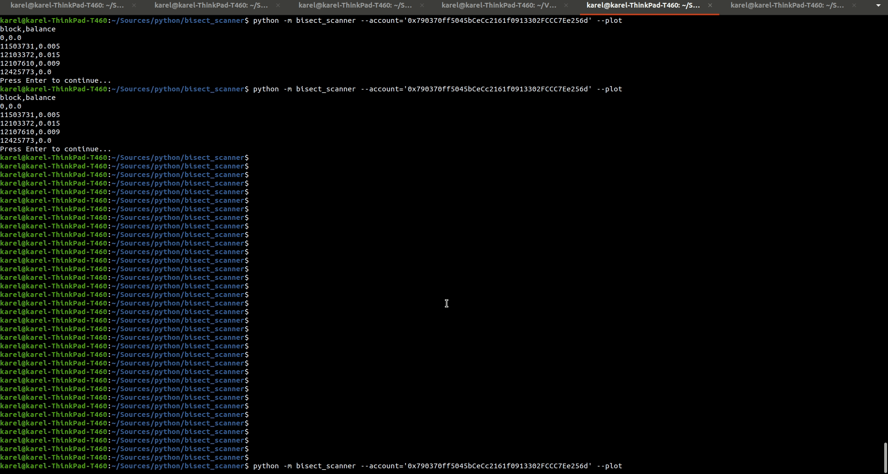

# bisect_scanner

Scan for balance history

## Usage

```python
>>> from bisect_scanner import W3Scanner
>>> W3_URL = '...' # w3 archive node url
>>> account = '0x790370ff5045bCeCc2161f0913302FCCC7Ee256d'
# https://etherscan.io/address/0x790370ff5045bCeCc2161f0913302FCCC7Ee256d
>>> scanner = W3Scanner(W3_URL)
>>> [*eth.balance_history('0x790370ff5045bCeCc2161f0913302FCCC7Ee256d')] 
[(0, 0.0),
 (11503731, 0.005),
 (12103372, 0.015),
 (12107610, 0.009),
 (12425773, 0.0)]
```

## Installing bisect_scanner

bisect_scanner is available on PyPI:

```console
$ pip install bisect-scanner
```

## Command line utility


```console
$ python -m bisect_scanner --help
usage: python -m bisecect_scanner [-h] [--account ACCOUNT]
                                  [--scan_step SCAN_STEP]
                                  [--precission PRECISSION]
                                  [--interpolation_step INTERPOLATION_STEP]
                                  [--start_block START_BLOCK]
                                  [--end_block END_BLOCK] [--polygon]
                                  [--ethereum] [--fake] [--plot]

Outputs account balance history on stdout in a csv format, also can plot a
chart with --plot switch. Example: python -m bisect_scanner
--account=0xCD6909C37CCEA877a5c8e9a3ffd69d9D9943409F

optional arguments:
  -h, --help            show this help message and exit
  --account ACCOUNT     address
  --scan_step SCAN_STEP
                        scan step
  --precission PRECISSION
                        precission
  --interpolation_step INTERPOLATION_STEP
                        interpolation step
  --start_block START_BLOCK
                        Start Block
  --end_block END_BLOCK
                        End Block
  --polygon             Polygon (MATIC native Token)
  --ethereum            Ethereum mainnet (default)
  --fake                Ethereum
  --plot                plot chart

```

### An Example


```console
$ python -m bisect_scanner --account='0x790370ff5045bCeCc2161f0913302FCCC7Ee256d' --plot
```




## Authors

`bisect_scanner` was written by `Karel Novak`.
